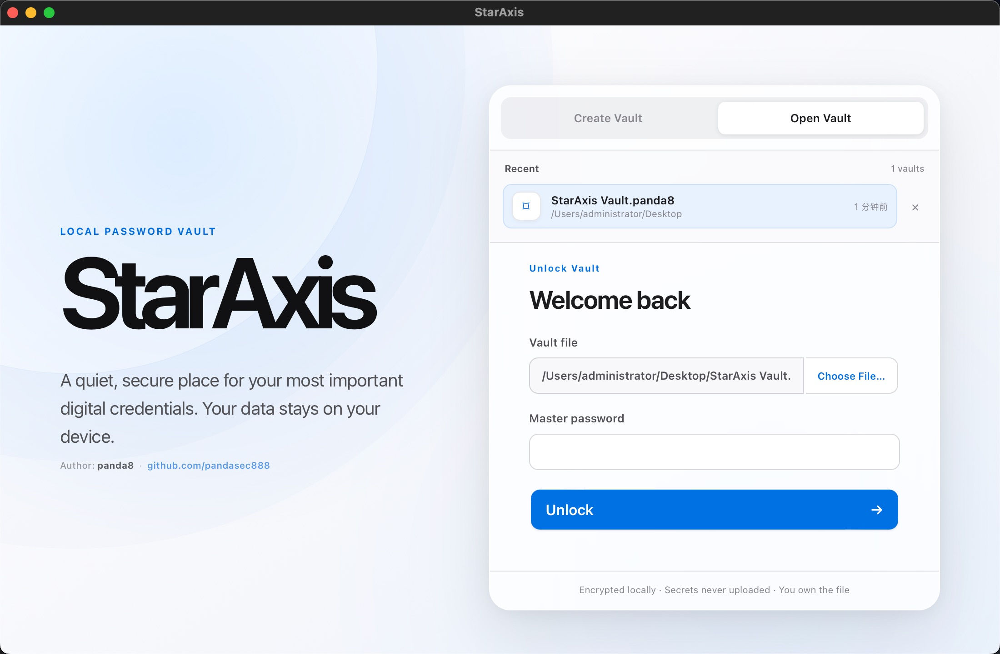
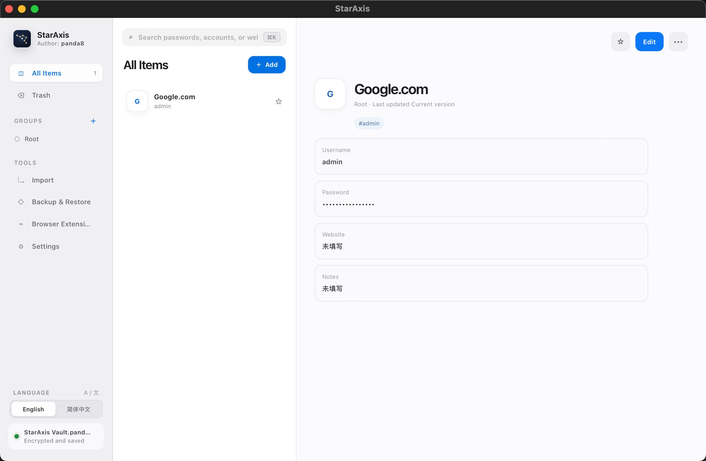
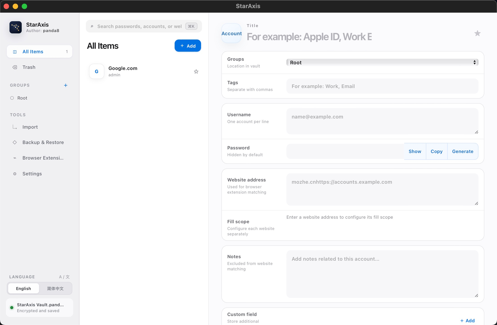

<p align="center">
  
</p>

<h1 align="center">StarAxis</h1>

<p align="center">
  A password manager that stores all data locally.
</p>

<p align="center">
  <a href="README.zh-CN.md">简体中文</a>
</p>

StarAxis (星枢) is a password manager that stores all data locally in
a portable, encrypted `.panda8` vault. It does not use SQLite, does not require
an account, and does not upload your vault to a remote service.



## Highlights

- Portable, encrypted `.panda8` vaults with a user-selected file location
- Login records, secure notes, groups, tags, favorites, search, and Trash
- Password and passphrase generation
- CSV import with preview and field mapping
- Encrypted backup, authenticated restore, and configurable local history
- Master-password rotation and an optional offline recovery key
- Automatic locking and conditional clipboard clearing
- Menu bar/system tray operation with quick vault unlocking
- Independent English and Simplified Chinese settings for the desktop app and
  browser extensions
- Browser-assisted credential matching, filling, saving, and updating

## Security model

StarAxis is designed around a local, standalone vault rather than an embedded
database:

- Each save serializes and encrypts the complete vault snapshot with a fresh
  nonce.
- Secret-bearing Rust types are cleared from memory on drop where supported.
- Saves use platform-specific replacement and rollback handling to reduce the
  risk of a partially written vault.
- Browser extensions communicate with the unlocked desktop app through an
  authenticated, encrypted local channel.

The `.panda8` format is StarAxis's own versioned file format.

StarAxis cannot recover a forgotten master password unless you created and
retained a recovery key. A copied vault can still be attacked offline, so use a
unique master password with sufficient entropy.

## Platform status

| Target  | Current status                                                                               |
| ------- | -------------------------------------------------------------------------------------------- |
| macOS   | Universal app for Intel and Apple Silicon; minimum macOS 11                                  |
| Windows | x86-64 offline installer with WebView2 included                                              |
| Linux   | Source build is supported; release packaging and clean-system validation are pending         |
| Chrome  | Main browser-extension development and testing target                                        |
| Edge    | Shares the Chromium implementation; production ID and full end-to-end validation are pending |
| Firefox | Has a dedicated Manifest V3 build; signing and full end-to-end validation are pending        |
| Safari  | Not implemented                                                                              |

Packaged development builds, when available, are documented under
[`release/`](release/). Windows and macOS may warn about an unknown developer
until signed releases are available.

## ## Contributing

Bug reports, design discussions, tests, documentation improvements, and
well-scoped pull requests are welcome.

Before opening a pull request:

```bash
pnpm check
pnpm build
```

Please do not include real vaults, passwords, recovery keys, or unredacted CSV
exports in issues, logs, fixtures, or pull requests. For security-sensitive
reports, avoid public disclosure until a private reporting channel is published.

## License

The workspace is licensed under **AGPL-3.0-or-later**.

## Author

Created and maintained by [panda8](https://github.com/pandasec888).
