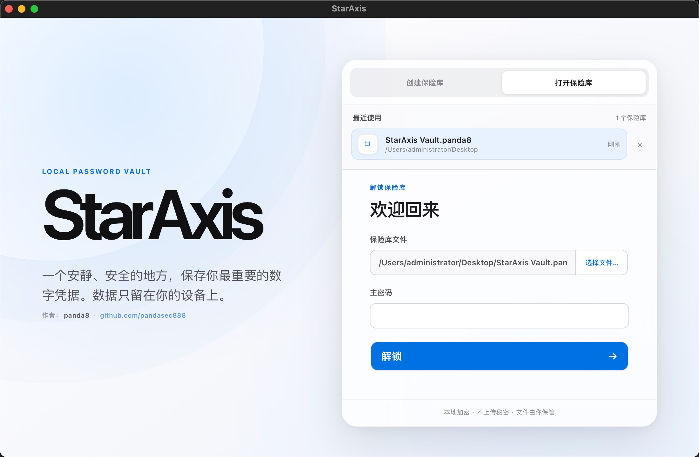
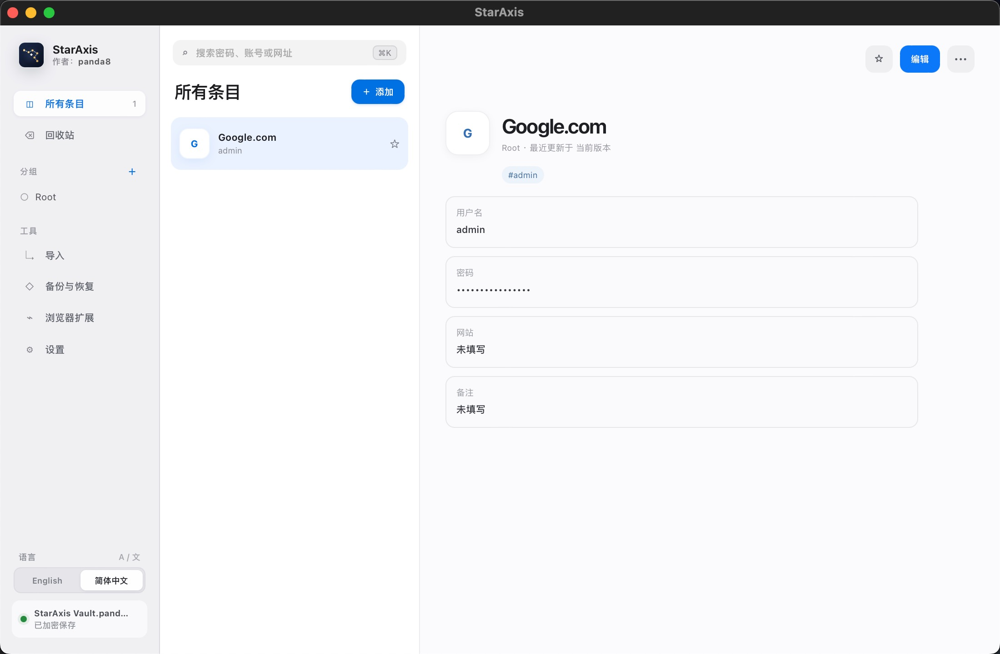
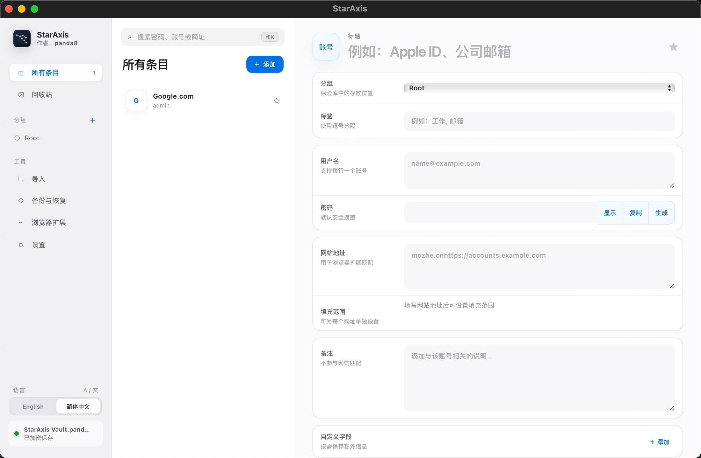

<p align="center">
  
</p>

<h1 align="center">星枢 StarAxis</h1>

<p align="center">
  一款所有数据都存储在本地的密码、笔记管理器。
</p>

<p align="center">
  <a href="README.md">English</a>
</p>

星枢是一款所有数据都存储在本地的密码、笔记管理器。账号密码和安全笔记保存在可移动、全加密的
`.panda8` 保险库中。它不使用 SQLite，不要求注册账号，也不会将保险库上传到远程服务。




## 主要功能

- 可自行选择保存位置的独立加密 `.panda8` 保险库
- 账号密码、安全笔记、分组、标签、收藏、搜索与回收站
- 密码和密码短语生成
- 支持预览和字段映射的 CSV 导入
- 加密备份、认证恢复和可配置的本地历史版本
- 修改主密码以及可选的离线恢复密钥
- 自动锁定和条件式剪贴板清理
- macOS 菜单栏及系统托盘驻留，可快速解锁保险库
- 桌面端与浏览器扩展分别支持 English / 简体中文切换
- 浏览器账号匹配、填充、保存和更新

## 安全模型

星枢使用本地独立保险库，而不是嵌入式数据库：

- 每次保存都会重新序列化完整快照，并使用新的随机 nonce 加密。
- 包含秘密数据的 Rust 类型会在支持的情况下于释放时清理内存。
- 使用各平台对应的文件替换和回滚机制，降低保险库只写入一部分的风险。
- 浏览器扩展通过经过认证和加密的本机通道与已解锁桌面端通信。

`.panda8` 是星枢自有的版本化文件格式。

除非你已经创建并妥善保管恢复密钥，否则星枢无法找回遗忘的主密码。保险库副本仍可能遭受离线猜测攻击，因此应使用具有足够熵且未在其他地方使用的主密码。

## 平台状态

| 目标      | 当前状态                                         |
| ------- | -------------------------------------------- |
| macOS   | 同时支持 Intel 与 Apple Silicon，最低 macOS 11       |
| Windows | x86-64 离线安装包，内置 WebView2                     |
| Linux   | 支持从源码构建，发布打包和干净环境验证仍待完成                      |
| Chrome  | 浏览器扩展当前主要开发和测试目标                             |
| Edge    | 与 Chrome 共用 Chromium 实现，正式扩展 ID 和完整端到端验证仍待完成 |
| Firefox | 已生成独立 Manifest V3 产物，签名和完整端到端验证仍待完成          |
| Safari  | 尚未实现                                         |

已生成的开发安装包及其说明位于 [`release/`](release/) 目录。正式签名前，Windows
和 macOS 可能提示未知开发者。

## 参与贡献

欢迎提交缺陷报告、设计讨论、测试、文档改进以及范围明确的 Pull Request。

提交 Pull Request 前请运行：

```bash
pnpm check
pnpm build
```

请勿在 Issue、日志、测试夹具或 Pull Request 中上传真实保险库、密码、恢复密钥或未经脱敏的 CSV
导出文件。对于安全敏感问题，在私密报告渠道发布前请避免公开披露。

## 许可证

本项目工作区使用 **AGPL-3.0-or-later** 许可证。

## 作者

由 [panda8](https://github.com/pandasec888) 创建并维护。
